# COVID19 Data Visualization with Python

- This is my [data source.](https://ourworldindata.org/coronavirus-source-data)  
- You can follow me on [Twitter](https://twitter.com/BaturalpYalcin) and check my [GitHub Page](https://github.com/baturalpyalcinn) to be kept updated about my work.  

### March 27 (Latest)
**For Comparitive Plots:** You can find comparitive plots of the countries in the world from [here.](March_27/Covid19_March_27_Plots.html)  
**For Turkey:** You can find plots and figures related to Turkey from [here.](March_27/Covid19_March_27_Turkey.html)   
**For Testing Numbers:** You can find plots and figures regarding daily testing numbers of some countries [here.](March_27/Covid19_Testing.html)  
**For Forecast Study:** 
- You can find **Linear Regression** forecast for some specific countries [here.](March_27/Covid19_March_27_Forecast_LR.html)  
- You can find **Damped Exponential Smoothing** forecast for some specific countries [here.](March_27/Covid19_March_27_Forecast_ES.html)  

**Some *updates*:**  
- I have adjusted testing numbers so that we can see the increase in the testing numbers after the spread has begun in each country.

**My forecasts for each country are based on whichever method works best for a specific country.**

| Country      | March 26 (Actual) | March 27 (Forecast)    | 
| :---        |    :----:   |          ---: |
| World exc. China      | 445,946      |  505,080 |
| Turkey      | 3,629      | 4,580  | 
| Italy   | 80,539       |  86,114  | 
| United States      | 85,991      | 103,151  | 
| Spain   | 56,188       | 66,717   |  
| United Kingdom   | 11,658      | 14,058  |   
| France   | 29,155       | 33,025 |     

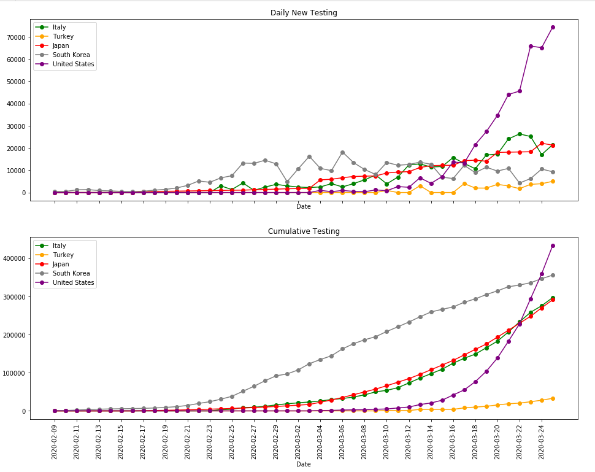  
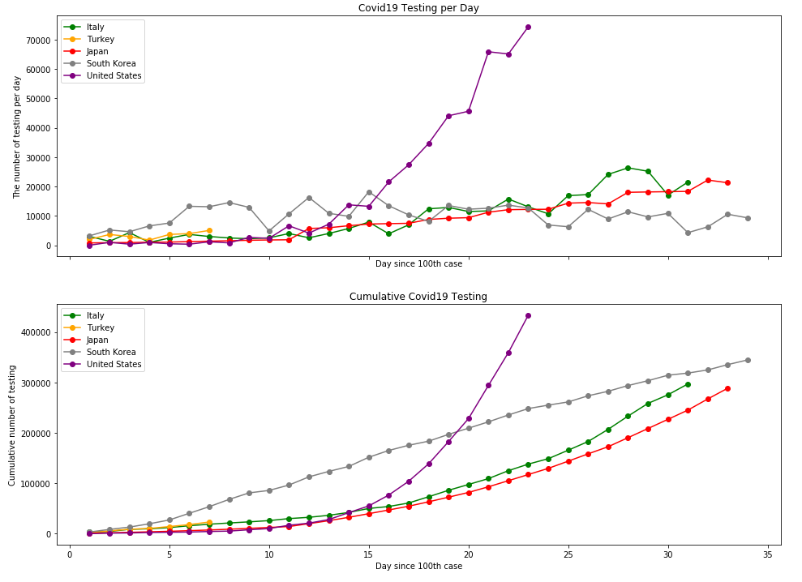   
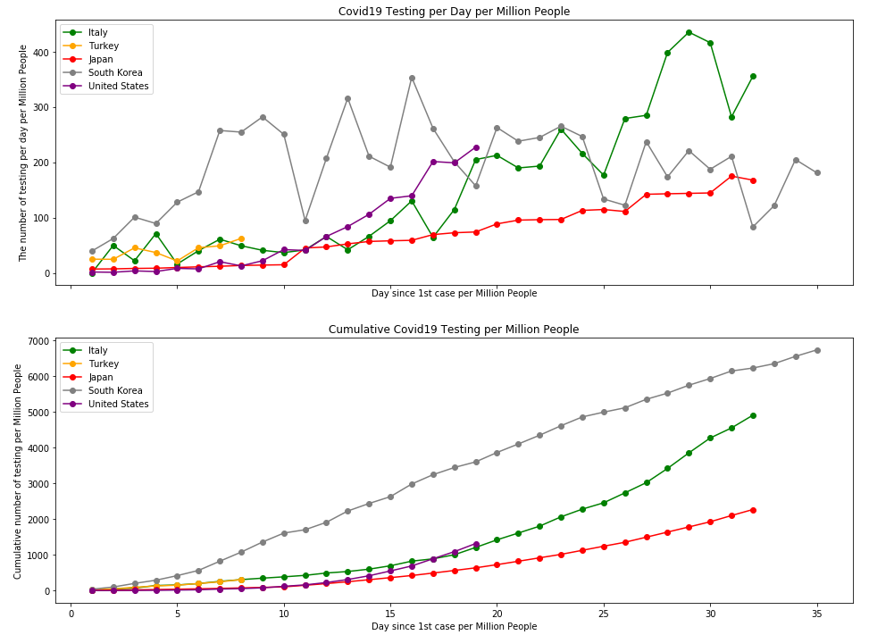 

### March 26
**For Comparitive Plots:** You can find comparitive plots of the countries in the world from [here.](March_26/Covid19_March_26_Plots.html)  
**For Turkey:** You can find plots and figures related to Turkey from [here.](March_26/Covid19_March_26_Turkey.html)   
**For Testing Numbers:** You can find plots and figures regarding daily testing numbers of some countries [here.](March_26/Covid19_Testing.html)  
**For Forecast Study:** 
- You can find **Linear Regression** forecast for some specific countries [here.](March_26/Covid19_March_26_Forecast_LR.html)  
- You can find **Damped Exponential Smoothing** forecast for some specific countries [here.](March_26/Covid19_March_26_Forecast_ES.html)  

**My forecasts for each country are based on whichever method works best for a specific country.**

| Country      | March 25 (Actual) | March 26 (Forecast)    | 
| :---        |    :----:   |          ---: |
| World exc. China      | 385,742      |  438,150 (-13%) |
| Turkey      | 2,433      |  3,090 (-56%) | 
| Italy   | 74,386       | 79,457 (-18%)    | 
| United States      | 69,194       | 84,205 (-11%)  | 
| Spain   | 47,610       | 54,421  (-21%)   |  
| United Kingdom   | 9,529      |  11,387 (-13%) |   
| France   | 25,233       | 28,409 (-19%) |     

*"New plot for logarithm of total cases per million in some countries vs. day since 1st case per million people is added. According to this new plot, the huge leap in the number of cases in the US may result from its population. Apart from that, after the total cases are adjusted for the population, the trend in every country seems like on more similar paths."*

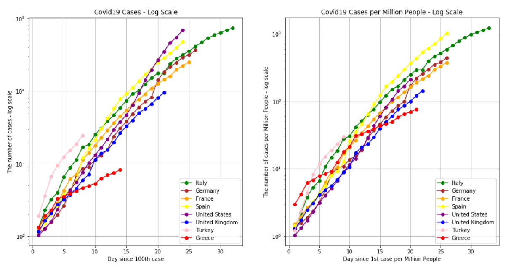 

### March 25
**For Comparitive Plots:** You can find comparitive plots of the countries in the world from [here.](March_25/Covid19_March_25_Plots.html)  
**For Turkey:** You can find plots and figures related to Turkey from [here.](March_25/Covid19_March_25_Turkey.html)   
**For Forecast Study:** 
- You can find **Linear Regression** forecast for some specific countries [here.](March_25/Covid19_March_25_Forecast_LR.html)  
- You can find **Damped Exponential Smoothing** forecast for some specific countries [here.](March_25/Covid19_March_25_Forecast_ES.html)  

- *"Although the number of new cases anounced per day has slowed in Turkey, percentage of patients who tested positive are at a constant level around 8-9%. The absolute number of testings are failed to increase rapidly as expected. Therefore, as the number of testing grows, Turkey might continue to grow exponentially in terms of total number of patients."*  

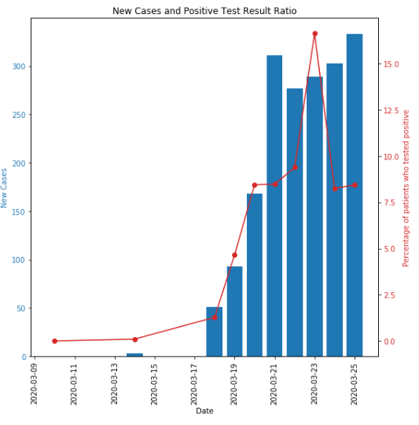  

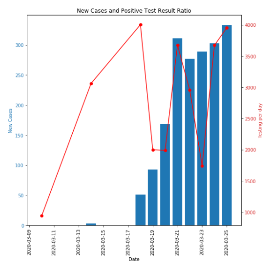  

### March 24
**For Comparitive Plots:** You can find comparitive plots of the countries in the world from [here.](March_24/Covid19_March_24_Plots.html)  
**For Forecast Study:** You can find forecast for some specific countries [here.](March_24/Covid19_March_24_Forecast.html)  
**For Turkey:** You can find plots and figures related to Turkey from [here.](March_24/Covid19_March_24_Turkey.html)   

**Some *updates*:**  
- I have added damped exponential smoothing method under the forecast section to estimate future total cases.
- I started to keep track of daily testing number for Turkey. You can see the plots under the Turkey section.  

- **Purple** curve performs the best according to recent updates in **Turkey**.    
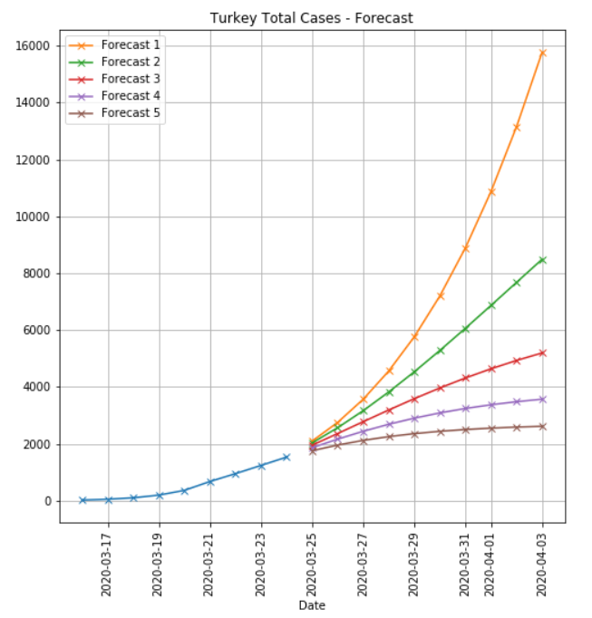  

- **Red** curve performs the best according to recent updates in **Italy**.  
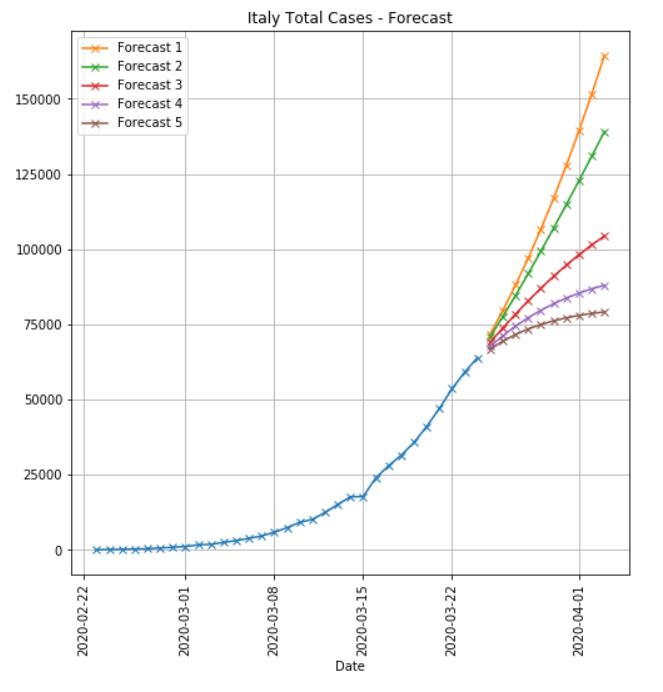  

- **Yellow** curve performs the best according to recent updates in **the US**.  
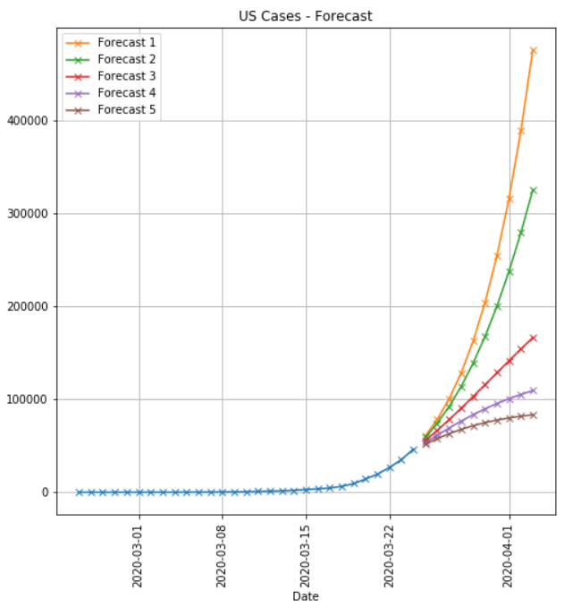  

- **Green** curve performs the best according to recent updates in **Spain**.  
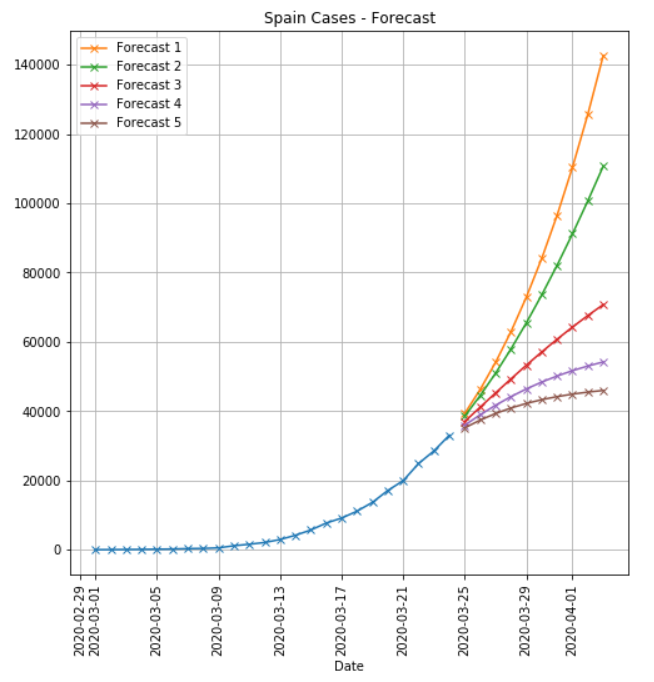    

- **Green** curve performs the best according to recent updates in **the UK**.  
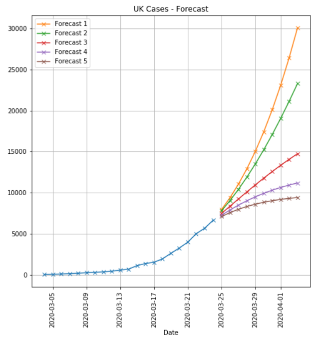  

### March 23
**For Comparitive Plots:** You can find comparitive plots of the countries in the world from [here.](March_23/Covid19_March_23_Plots.html)  
**For Forecast Study:** You can find forecast for some specific countries [here.](March_23/Covid19_March_23_Forecast.html)  
**For Turkey:** You can find plots and figures related to Turkey from [here.](March_23/Covid19_March_23_Turkey.html)    

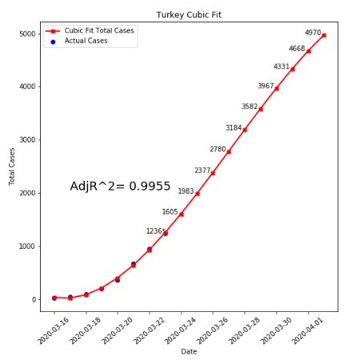
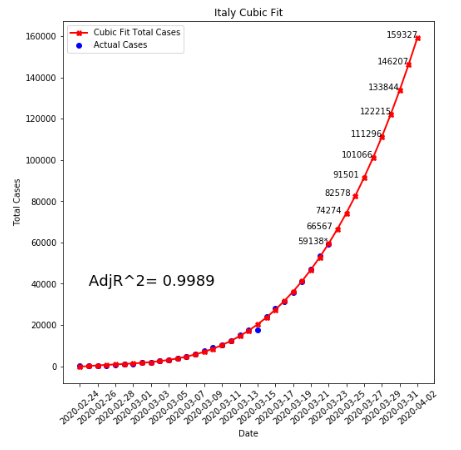
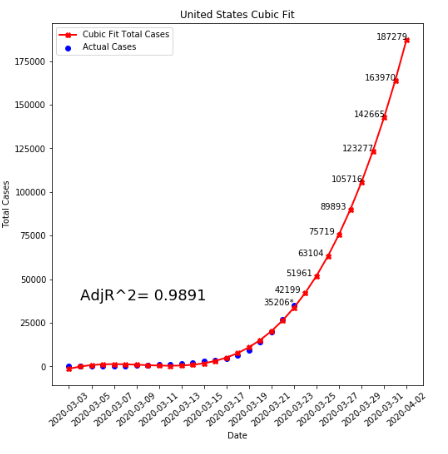
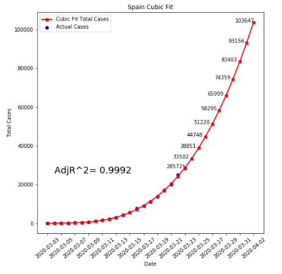

### March 22
[Here](Covid19_March_22.html) is the March 22 version of my work.  
**For Turkey:** You can find plots and figures related to Turkey from [here](Covid19_March_22_Turkey.html).  

*"Here is a new plot for Turkey depicting the capacity of the hospitals in Turkey and how long they can accomodate new patients under exponential growth. According to the plot, if the number of COVID 19 cases continue to grow exponentially, there will not be enough hospital beds until March 30th assuming that every patient will be hospitalized."*  

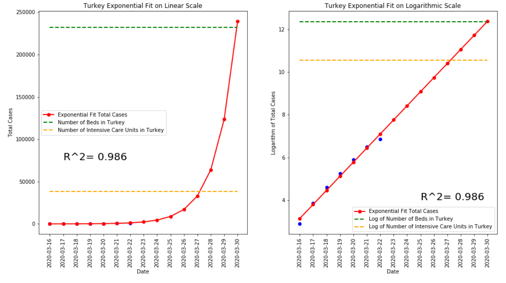

### March 21
[Here](Covid19_March_21.html) is the March 21 version of my work.

### March 20
[Here](Covid19_March_20.html) is the first version of my work.

